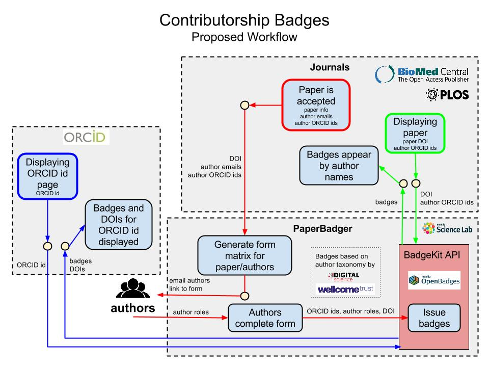
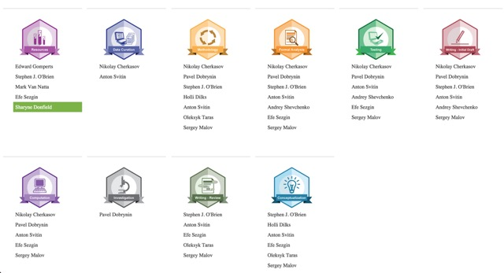

# PaperBadger [](https://travis-ci.org/mozillascience/PaperBadger)

Exploring the use of digital badges for crediting contributors to scholarly papers for their work

As the research environment becomes more digital, we want to test how we can use this medium to help bring transparency and credit for individuals in the publication process.

This work is a collaboration with publishers [BioMed Central](http://www.biomedcentral.com/) (BMC) and the [Public Library of Science](http://www.plos.org/) (PLoS); the biomedical research foundation, [The Wellcome Trust](http://www.wellcome.ac.uk/); the software and technology firm [Digital Science](http://www.digital-science.com/); the registry of unique researcher identifiers, [ORCID](http://orcid.org/); and the [Mozilla Science Lab](http://mozillascience.org/).




### Getting Started

#### Project Setup

1. Clone PaperBadger and enter the directory: `git clone https://github.com/mozillascience/PaperBadger && cd PaperBadger`
2. Install PaperBadger's Node dependencies: `npm install`
3. If you would like to override the default, create `.env` file in your favourite text editor.

`PORT`, `SESSION_SECRET`, `BADGES_ENDPOINT`, `BADGES_KEY`, `BADGES_SECRET`, `BADGES_SYSTEM`, `ORCID_AUTH_CLIENT_ID`, `ORCID_AUTH_CLIENT_SECRET`, `ORCID_AUTH_SITE`, `ORCID_AUTH_TOKEN_PATH` and `ORCID_REDIRECT_URI` environment variables are set to the correct values. `PORT` can be any available port.
If you would like to develop against the hosted custom badgekit-api we have running specificaly for PaperBadger testing, your environment values should look this:

        # default port is 5000
        export PORT=5000
        export SESSION_SECRET=USE_SOMETHING_GOOD_LIKE_puUJjfE6QtUnYryb

        # Badges
        export BADGES_ENDPOINT=http://badgekit-api-sciencelab.herokuapp.com/
        export BADGES_KEY=master
        export BADGES_SECRET=#############
        export BADGES_SYSTEM=badgekit

        # ORCID Auth
        export ORCID_AUTH_CLIENT_ID=#############
        export ORCID_AUTH_CLIENT_SECRET=#############
        export ORCID_AUTH_SITE=#############
        export ORCID_AUTH_TOKEN_PATH=#############
        export ORCID_REDIRECT_URI=#############

Ask @acabunoc for ones marked `###########`. Our custom BadgeKit API code can be found [here](https://github.com/acabunoc/badgekit-api).

5. Run `npm start`, and open up `http://localhost:5000/` in your favourite web browser!

### Using the Widget
Researchers earn badges for their specific contributions to an academic paper. A researcher who worked on investigation earns a prestigious investigation badge for that paper. 

The PaperBadger widget enables anyone to easily display badges on any website by including just a few lines of script with the relevant doi (digital object identifier) and a designated `<div>` in your view file. Authors can add the script to their own sites to display badges earned, while publishers can use the script to display all badges associated with a paper:



1. To use the widget on your own site, include a `<div>` with your custom class in your view file, for example:
    `<div class="my-container"></div>`

2. Add `<script src="https://badges.mozillascience.org/widgets/paper-badger-widget.js"></script>` above the closing `<body>` tag. 

3. In your scripts, include your custom class name as the value for the "container-class" key, for example:

```html
    <!DOCTYPE html>

    <html>
    <head>
    <title>Paper view snippet example | Paper Badger</title>
    </head> 
    <body>

    <div class="my-container"></div>

    <script src="https://badges.mozillascience.org/widgets/paper-badger-widget.js"></script>
    <script> 
        var conf={"article-doi": "10.1186/2047-217X-3-18", "container-class": "my-container"};
        showBadges(conf);
    </script>
    </body>
    </html>
```

### Contributing

[Project Roadmap: #17](https://github.com/mozillascience/paperbadger/issues/17)

Please review our contributing guidelines [here](CONTRIBUTING.md)

Want to help? Drop us a line in [this issue](https://github.com/mozillascience/PaperBadger/issues/2).

### API Endpoints

*   GET [/badges](http://badges.mozillascience.org/badges)
    *   Get all badges we issue
*   GET /badges/:badge
    *   Get all badge instances of a certain badge
    *   e.g. [/badges/formal_analysis](http://badges.mozillascience.org/badges/formal_analysis)
*   GET /users/:orcid/badges
    *   Get all badge instances earned by a user
    *   e.g. [/users/0000-0001-5979-8713/badges](http://badges.mozillascience.org/users/0000-0001-5979-8713/badges)
*   GET /users/:orcid/badges/:badge
    *   Get all badge instances of a certain badge earned by a user
    *   e.g. [/users/0000-0001-5979-8713/badges/data_curation](http://badges.mozillascience.org/users/0000-0001-5979-8713/badges/data_curation)
*   GET /papers/:doi1/:doi2/badges
    *   Get all badge instances for a paper.
    *   e.g. [/papers/10.1186/2047-217X-3-18/badges](http://badges.mozillascience.org/papers/10.1186/2047-217X-3-18/badges)
*   GET /papers/:doi1/:doi2/badges/:badge
    *   Get all badge instances of a certain badge for a paper.
    *   e.g. [/papers/10.1186/2047-217X-3-18/badges/investigation](http://badges.mozillascience.org/papers/10.1186/2047-217X-3-18/badges/investigation)
*   GET /papers/:doi1/:doi2/badges/:orcid/badges
    *   Get all badge instances earned by a user for a paper.
    *   e.g. [/papers/10.1186/2047-217X-3-18/users/0000-0001-5979-8713/badges](http://badges.mozillascience.org/papers/10.1186/2047-217X-3-18/users/0000-0001-5979-8713/badges)
*   GET /papers/:doi1/:doi2/badges/:orcid/badges/:badge
    *   Get all badge instances of a certain badge earned by a user for a paper.
    *   e.g. [/papers/10.1186/2047-217X-3-18/users/0000-0001-5979-8713/badges/data_curation](http://badges.mozillascience.org/papers/10.1186/2047-217X-3-18/users/0000-0001-5979-8713/badges/data_curation)
*   POST /papers/:doi1/:doi2/badges/:orcid/badges/:badge
    *   Issue a badge
