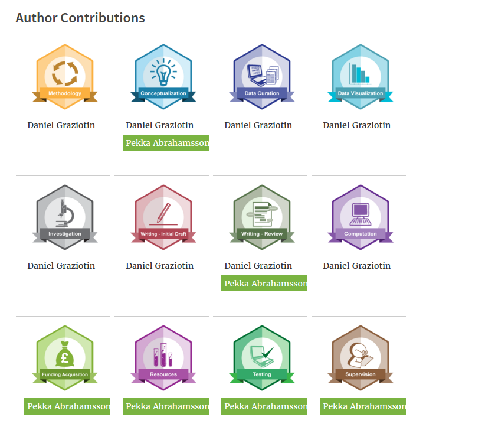

# PaperBadger [](https://travis-ci.org/mozillascience/PaperBadger)

[](https://gitter.im/mozillascience/PaperBadger?utm_source=badge&utm_medium=badge&utm_campaign=pr-badge&utm_content=badge)

Issuing badges to credit authors for their work on academic papers

As the research environment becomes more digital, we want to test how we can use this medium to help bring transparency and credit for individuals in the publication process.

## Using Paper Badger

You can display contributorship badges for science on your own site! Researchers earn badges for their specific contributions to an academic paper. A researcher who worked on investigation earns a prestigious investigation badge for that paper.

The PaperBadger widget enables *anyone*, from publishers to individual researchers, to easily display badges on a website by including just a few lines of script with the relevant doi (digital object identifier) and a designated `<div>` in your view file. Authors can add the script to their own sites to display badges earned, while publishers can use the script to display all badges associated with a paper:

You can either use paper-badger-widget.js ([documentation](docs/paper-badger-widget.md)), which supports old browsers or widget.js ([documentation](docs/widget.md)), which is in development and currently only supports evergreen browsers and IE9+.

### Current Users

Two journals, [GigaScience (BioMed Central)](http://gigascience.biomedcentral.com/) and [Journal of Open Research Software (Ubiquity Press)](http://openresearchsoftware.metajnl.com/) have added the Paper Badger widget to their papers. 

JORS example: [A Web-based modeling tool for the SEMAT Essence theory of software engineering](http://openresearchsoftware.metajnl.com/articles/10.5334/jors.ad/metrics/#author-contributions)



## Contributing

[Project Roadmap: #17](https://github.com/mozillascience/paperbadger/issues/17)

Want to help? We love new contributors! Please review our [contributing guidelines](CONTRIBUTING.md) and take a look at some [good first bugs](https://github.com/mozillascience/PaperBadger/labels/good%20first%20bug).

### Getting Started

Are you ready to contribute to Paper Badger? This section will help you set up your own development version of the Contributorship Badges prototype.

Clone PaperBadger and enter the directory: `git clone https://github.com/mozillascience/PaperBadger && cd PaperBadger`

#### Run using Docker

You can use Docker to bring up a quick instance of the app to develop against. This way you dont need to have node or mongo installed on your host.

* Make sure you have [Docker](https://www.docker.com/) and docker-compose installed.
* Setup your environment variables, or copy over the test file
```bash
sed 's/export //' env.test > env.docker
```
* build images and bring up the service
```bash
docker-compose build
docker-compose up
```
* visit the running service
  * If on Linux host: http://localhost:5000
  * If not Linux: http://(docker host ip):5000 (You can find your docker IP with `docker-machine ip default`)


#### Run locally

* Install PaperBadger's Node dependencies: `npm install`
* If you would like to override the default, create `.env` file in your favourite text editor.

`PORT`, `SESSION_SECRET`, `BADGES_ENDPOINT`, `BADGES_KEY`, `BADGES_SECRET`, `BADGES_SYSTEM`, `ORCID_AUTH_CLIENT_ID`, `ORCID_AUTH_CLIENT_SECRET`, `ORCID_AUTH_SITE`, `ORCID_AUTH_TOKEN_PATH` and `ORCID_REDIRECT_URI` environment variables are set to the correct values. `PORT` can be any available port.
If you would like to develop against the hosted custom badgekit-api we have running specificaly for PaperBadger testing, your environment values should look this:

        # default port is 5000
        export PORT=5000
        export SESSION_SECRET=USE_SOMETHING_GOOD_LIKE_puUJjfE6QtUnYryb

        # Badges
        export BADGES_ENDPOINT=http://badgekit-api-sciencelab.herokuapp.com/
        export BADGES_KEY=master
        export BADGES_SECRET=#############
        export BADGES_SYSTEM=badgekit

        # ORCID Auth
        export ORCID_AUTH_CLIENT_ID=#############
        export ORCID_AUTH_CLIENT_SECRET=#############
        export ORCID_AUTH_SITE=#############
        export ORCID_AUTH_TOKEN_PATH=#############
        export ORCID_REDIRECT_URI=#############

Ask [@acabunoc](http://github.com/acabunoc) for ones marked `###########`. Our custom BadgeKit API code can be found [here](https://github.com/acabunoc/badgekit-api).

* Run `npm start`, and open up `http://localhost:5000/` in your favourite web browser!

To run the application successfully you need to have [mongodb](https://www.mongodb.org/) server and [redis-server](http://redis.io/download) running locally. You can install these from their offical website or use your favorite package manager.

#### Adding user as a publisher

Run `npm start`, and open up mongo shell in your terminal. It would connect you with the test database. Then follow these steps.

```js
db.users.insert({"name":"Your name", "orcid":"Your ORCID", "role":"publisher"})
```

### API Endpoints

*   GET [/badges](http://badges.mozillascience.org/badges)
    *   Get all badges we issue
*   GET /badges/:badge
    *   Get all badge instances of a certain badge
    *   e.g. [/badges/formal_analysis](http://badges.mozillascience.org/badges/formal_analysis)
*   GET /users/:orcid/badges
    *   Get all badge instances earned by a user
    *   e.g. [/users/0000-0001-5979-8713/badges](http://badges.mozillascience.org/users/0000-0001-5979-8713/badges)
*   GET /users/:orcid/badges/count
    *   Get a count of all badge instances earned by a user
    *   e.g. [/users/0000-0001-5979-8713/badges/count](http://badges.mozillascience.org/users/0000-0001-5979-8713/badges/count)
*   GET /users/:orcid/badges/:badge
    *   Get all badge instances of a certain badge earned by a user
    *   e.g. [/users/0000-0001-5979-8713/badges/data_curation](http://badges.mozillascience.org/users/0000-0001-5979-8713/badges/data_curation)
*   GET /papers/:doi1/:doi2/badges
    *   Get all badge instances for a paper.
    *   e.g. [/papers/10.1186/2047-217X-3-18/badges](http://badges.mozillascience.org/papers/10.1186/2047-217X-3-18/badges)
*   GET /papers/:doi1/:doi2/badges/count
    *   Get a count of all badge instances for a paper.
    *   e.g. [/papers/10.1186/2047-217X-3-18/badges/count](http://badges.mozillascience.org/papers/10.1186/2047-217X-3-18/badges/count)
*   GET /papers/:doi1/:doi2/badges/:badge
    *   Get all badge instances of a certain badge for a paper.
    *   e.g. [/papers/10.1186/2047-217X-3-18/badges/investigation](http://badges.mozillascience.org/papers/10.1186/2047-217X-3-18/badges/investigation)
*   GET /papers/:doi1/:doi2/badges/:orcid/badges
    *   Get all badge instances earned by a user for a paper.
    *   e.g. [/papers/10.1186/2047-217X-3-18/users/0000-0001-5979-8713/badges](http://badges.mozillascience.org/papers/10.1186/2047-217X-3-18/users/0000-0001-5979-8713/badges)
*   GET /papers/:doi1/:doi2/badges/:orcid/badges/:badge
    *   Get all badge instances of a certain badge earned by a user for a paper.
    *   e.g. [/papers/10.1186/2047-217X-3-18/users/0000-0001-5979-8713/badges/data_curation](http://badges.mozillascience.org/papers/10.1186/2047-217X-3-18/users/0000-0001-5979-8713/badges/data_curation)
*   POST /papers/:doi1/:doi2/badges/:orcid/badges/:badge
    *   Issue a badge

***

This work is a collaboration with publishers [BioMed Central](http://www.biomedcentral.com/) (BMC), [Ubiquity Press](http://www.ubiquitypress.com/) (UP) and the [Public Library of Science](http://www.plos.org/) (PLoS); the biomedical research foundation, [The Wellcome Trust](http://www.wellcome.ac.uk/); the software and technology firm [Digital Science](http://www.digital-science.com/); the registry of unique researcher identifiers, [ORCID](http://orcid.org/); and the [Mozilla Science Lab](http://mozillascience.org/).

